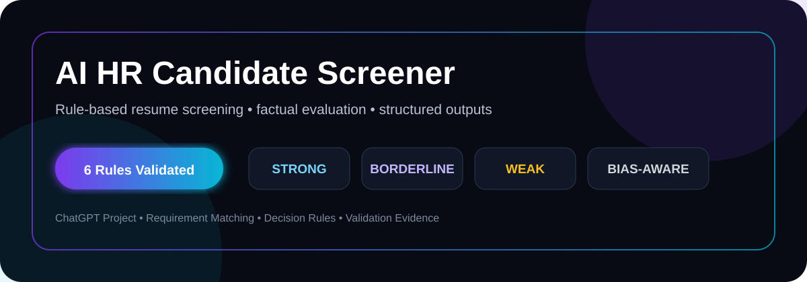
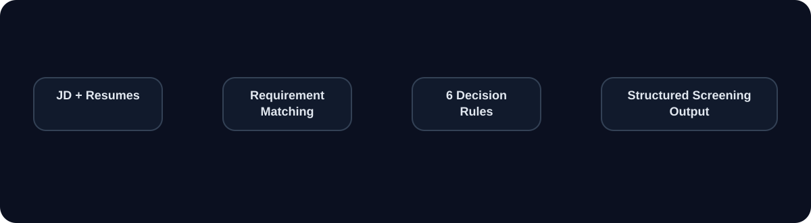
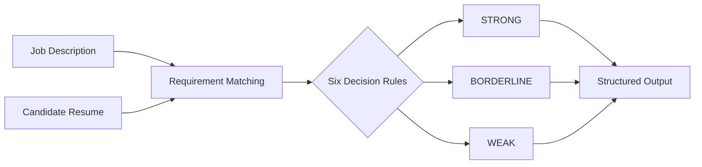

<!-- SHOWCASE_START --><div align="center">[](https://github.com/shaikshahid777/ai-hr-candidate-screener)

[](https://github.com/shaikshahid777/ai-hr-candidate-screener) [](https://github.com/shaikshahid777/ai-hr-candidate-screener/issues/new) [](https://github.com/shaikshahid777/ai-hr-candidate-screener/stargazers) [](https://github.com/shaikshahid777/ai-hr-candidate-screener/fork) [](https://github.com/shaikshahid777)</div>

> ✨ **Project Showcase Mode:** animated banner • interactive navigation • live repository actions

[🚀 Repository](https://github.com/shaikshahid777/ai-hr-candidate-screener) · [🐞 Report Issue](https://github.com/shaikshahid777/ai-hr-candidate-screener/issues/new) · [⭐ Star](https://github.com/shaikshahid777/ai-hr-candidate-screener/stargazers) · [🔱 Fork](https://github.com/shaikshahid777/ai-hr-candidate-screener/fork) · [👤 Profile](https://github.com/shaikshahid777)

<!-- SHOWCASE_END -->

# AI HR Candidate Screener

<p align="center">
  
</p>

<p align="center">
  <strong>Assessment-ready AI screening workspace • 6/6 rule validation • structured & bias-aware evaluation</strong>
</p>

<p align="center">
  <a href="https://www.loom.com/share/12321feeaa3540c29236be66419707da"></a>
  <a href="https://chatgpt.com/share/6aba60f3-4c60-83ee-9a8b-47840f597c9a"></a>
  <a href="#validation-dashboard"></a>
  <a href="docs/project-configuration.md"></a>
</p>

<p align="center">
  
</p>

---

## ⚡ What This Project Does

The **AI HR Candidate Screener** is a ChatGPT Project workspace designed to compare candidate resumes with job descriptions and apply six strict screening rules.

It produces a consistent four-part result:

**Candidate Profile → Classification → Evidence-Based Justification → Follow-up**

> **Important:** This project is a screening automation capstone. It is configured to avoid protected characteristics, avoid invented qualifications, avoid external candidate searches, and avoid making hiring decisions.

## 🧠 Architecture

<p align="center">
  
</p>

## 🎛️ Quick Access

| Action | Open |
|---|---|
| 🎥 **Watch Demo** | [Loom demonstration](https://www.loom.com/share/12321feeaa3540c29236be66419707da) |
| 🤖 **Open Workspace** | [ChatGPT Project](https://chatgpt.com/share/6aba60f3-4c60-83ee-9a8b-47840f597c9a) |
| ⚙️ **Configuration** | [Project configuration](docs/project-configuration.md) |
| 🧪 **Validation** | [Validation report](docs/validation-report.md) |
| 📚 **Source Materials** | [Source materials](docs/source-materials.md) |
| 📝 **Assessment Notes** | [Assessment notes](docs/assessment-notes.md) |

## 🔐 Six Decision Rules

| Rule | Scenario | Required behavior |
|---|---|---|
| **01** | Missing Info | **BORDERLINE** → request missing email/phone |
| **02** | Weak Data | **WEAK** → archive according to rule |
| **03** | Certifications vs Experience | **BORDERLINE** → 15-minute technical screening call |
| **04** | Multiple Options | Strongest skill match + alternative position fits |
| **05** | Unclear Tasks | **BORDERLINE** → generate 2–3 behavioral questions |
| **06** | Strong Match | **STRONG** → configured fast-track action |

## 📊 Validation Dashboard

| Test | Scenario | Rule | Result |
|:---:|---|:---:|:---:|
| 01 | Missing email + phone | Rule 1 | ✅ PASS |
| 02 | 2+ year experience shortfall + no certification | Rule 2 | ✅ PASS |
| 03 | No experience + 3 relevant certifications | Rule 3 | ✅ PASS |
| 04 | Multiple open-position matches | Rule 4 | ✅ PASS |
| 05 | Vague / unclear resume tasks | Rule 5 | ✅ PASS |
| 06 | All must-haves + 80%+ nice-to-haves | Rule 6 | ✅ PASS |

**Validation status: 6/6 scenarios completed.**

## 🧩 Required Screening Output

Every screening is structured into four sections:

1. **Candidate Profile Summary**
   - Name
   - Target Role
   - Key Strengths

2. **Screening Classification**
   - Status: STRONG / BORDERLINE / WEAK
   - Triggered Decision Rule

3. **Detailed Justification**
   - 2–3 evidence-based sentences

4. **Follow-up Questions/Recommendations**
   - Rule-specific next steps, especially for borderline cases

## 🛡️ Guardrails

- **Factuality:** qualifications must be supported by uploaded documents.
- **Bias prevention:** age, gender, location, and other protected characteristics are excluded from evaluation.
- **No external candidate research:** screening is grounded in supplied sources.
- **No hiring decision:** the system performs rule-based screening rather than deciding who should be hired.
- **Prompt protection:** configured refusal behavior prevents exposing or ignoring the screening instructions.

## 📦 Repository Contents

```text
.
├── README.md
├── assets/
│   ├── hero.svg
│   ├── architecture.svg
│   └── rules-pass.svg
├── docs/
│   ├── assessment-notes.md
│   ├── project-configuration.md
│   ├── source-materials.md
│   └── validation-report.md
├── 01_Sample_Job_Description_AI_Automation_Analyst.docx
├── 02_Strong_Candidate_Resume_Alex_Morgan.docx
├── 03_Weak_Candidate_Resume_Jordan_Lee.docx
├── 04_Borderline_Candidate_Resume_Taylor_Rivera.docx
├── 05_Borderline_Missing_Contact_Candidate_Resume.docx
├── 06_Weak_Candidate_Rule2_Resume(1).docx
├── 07_Open_Position_AI_Automation_Analyst.docx
├── 08_Open_Position_API_Integration_Specialist.docx
├── 09_Multiple_Options_Candidate_Resume_Jamie_Patel.docx
└── AI_HR_Candidate_Screener_LMS_Submission(1).pdf
```

## 🧪 Validation Flow



## 🎓 Assessment Evidence

The repository is backed by:
- Six rule-specific validation scenarios
- Source documents for job descriptions and resumes
- Project configuration documentation
- Validation report
- LMS submission PDF
- Loom walkthrough
- ChatGPT Project share

### Submission Links

<p align="center">
  <a href="https://www.loom.com/share/12321feeaa3540c29236be66419707da"></a>
  <a href="https://chatgpt.com/share/6aba60f3-4c60-83ee-9a8b-47840f597c9a"></a>
  <a href="AI_HR_Candidate_Screener_LMS_Submission(1).pdf"></a>
</p>

---

<p align="center">
  Built as an AI HR screening capstone focused on <strong>requirements matching, deterministic decision rules, factuality, and bias-aware evaluation.</strong>
</p>
